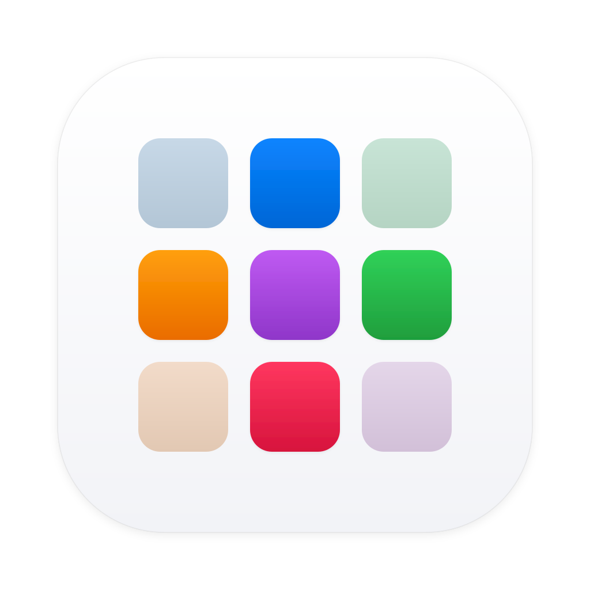

<p align="center">
  <br/>
  <strong>App Finder</strong><br/>
  <small>Applications library for macOS</small>
</p>

### Features

- 5000+ applications and 2000+ fonts available
- One click installs and upgrades
- Uninstall apps cleanly
- Powered by Homebrew, the leading package manager on MacOS
- Runs on macOS 13+

### How it works

> AppFinder aggregates official Homebrew cask formulas and installation analytics with structured categories and release dates provided by [CaskFlow](https://github.com/alielsokary/CaskFlow). 
> This catalog is indexed locally to enable fast searching and application management directly via Homebrew.

### Installation

Install via Homebrew:

```bash
brew install --cask yanbab/tap/appfinder
```

### Install from source

```bash
git clone https://github.com/yanbab/appfinder.git
cd appfinder
npm install
npm start
```

### Scripts

```bash
npm run fetch   # Update apps metadata
npm run build   # Build .app and .dmg
npm run clean   # Delete builds, caches and user config
```

### License

```
MIT License
```